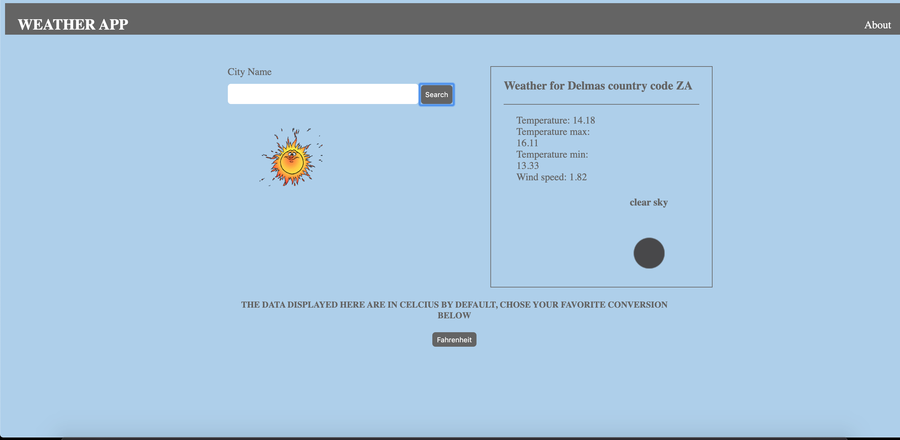

#  AWESOME WEATHER
A simple weather app to list weather about city and country location with cool gif about weather condition. You can list weather info in celcius or fahrenheit. 
<p align="center">
    
</p>

## Live version of the production comming soon


### Feature Currently available:

* search weather by city
* search weather by country 
* list info in celcius
* list info in fahrenheit
* Set set gif for weather condition


## Tech used 
* Html
* CSS
* JavaScript


## External library 

* Webpack
* node js
* css-loader
* file-loader


## Using the app in development 
Clone this repo (you need Node js installed in your computer).
```
$ git clone git@github.com:certilremy/weater-app.git
```

 Change to the app directory 
 
 ```
$ cd weater-app
 ```

   And run 

```
$ npm install 
```

To start the server you don't need other special server you can go to the project folder and click the index.html or install live server extention if you're using vsCode

## Authors

* Certil Remy    Github : https://github.com/certilremy

## Contribution 

If you want to contribute to this project you're welcome .
Follow the github code of conduct fork this repo and open your pull request. 
